# Resumen del flujo de trabajo

Cada funcionalidad sigue el mismo flujo de seis pasos. Cada paso tiene un rol definido, un comando de Claude y un artefacto de salida.

```
Cliente/Figma → Specs → TDD → Código → Revisión → Despliegue
      ↑            ↑       ↑      ↑          ↑           ↑
  Prompts       Agentes Handoffs Man-in-loop           gh CLI
```

## Paso 1 — Discovery (Cliente / Figma)

**Tu rol**: Analista de negocio + Investigador UX
**Rol de Claude**: Analista — detecta vacíos, sugiere preguntas de aclaración

### Qué haces
1. Toma notas durante la reunión con el cliente → guárdalas en `ai-specs/discovery/client-interviews/`
2. Captura pantallas de Figma → guarda el análisis en `ai-specs/discovery/figma-analysis/`
3. Pídele a Claude que identifique requisitos faltantes y casos extremos

### Ejemplo de prompt
```
Lee ai-specs/discovery/client-interviews/sesion-01.md
Actúa como Analista de Negocio. Identifica ambigüedades, requisitos faltantes
y sugiere 5 preguntas de aclaración para el cliente.
```

### Salida
Notas estructuradas + lista de preguntas resueltas

---

## Paso 2 — Specs

**Tu rol**: Product Owner
**Rol de Claude**: BA + Arquitecto

### Qué haces
1. Ejecuta `/enrich-us #N` para enriquecer un GitHub Issue sin detalle
2. Revisa la historia enriquecida — aprueba o corrige
3. Ejecuta `/plan-backend-ticket #N` y `/plan-frontend-ticket #N`
4. Revisa ambos planes antes de que se escriba cualquier código

### Salida
- GitHub Issue enriquecido con criterios de aceptación
- `ai-specs/changes/GH-N_backend.md`
- `ai-specs/changes/GH-N_frontend.md`

---

## Paso 3 — TDD

**Tu rol**: Tech Lead / QA
**Rol de Claude**: Ingeniero QA

Los tests se escriben **a partir del plan**, antes de cualquier implementación.

```
/develop-backend GH-N_backend.md
```

Claude escribe primero los tests fallidos, espera tu aprobación y luego implementa.

### Salida
Suite de tests en rojo (fallando) — esto es correcto en TDD ✅

---

## Paso 4 — Código

**Tu rol**: Tech Lead (supervisando)
**Rol de Claude**: Desarrollador

Claude implementa el código mínimo para que los tests pasen, siguiendo el plan paso a paso. Tú apruebas cada archivo antes de que se escriba.

### Salida
Todos los tests pasando en `feature/GH-N-backend` y `feature/GH-N-frontend`

---

## Paso 5 — Revisión

**Tu rol**: Revisor
**Rol de Claude**: Seguridad + QA + Tech Lead

```
/review-pr #N
```

Claude revisa el diff contra los estándares, publica el informe como comentario en el PR y lo aprueba o bloquea.

### Salida
PR aprobado (o lista de cambios requeridos antes del merge)

---

## Paso 6 — Despliegue

**Tu rol**: Director
**Rol de Claude**: DevOps

```
/deploy staging
```

Claude ejecuta las comprobaciones previas al despliegue (tests, lint, typecheck), lanza el workflow de GitHub Actions y espera tu aprobación explícita antes de tocar producción.

```
/deploy production
```

### Salida
Funcionalidad en producción + documentación actualizada

---

## La regla de oro

> **Más riesgo → más control tuyo. Menos riesgo → más autonomía para Claude.**

| Acción | Autonomía de Claude |
|---|---|
| Escribir un test | Alta — fácil de revertir |
| Escribir lógica de negocio | Media — lo revisas antes de aprobar |
| Crear un commit | Media — ves el diff primero |
| Abrir un PR | Baja — afecta a otros |
| Desplegar a producción | Mínima — irreversible |

---

## Diagrama completo del flujo

Roles, agentes, ficheros y puntos de decisión man-in-the-loop para cada fase.

```mermaid
flowchart TD
    START([Nueva funcionalidad])

    CFG["CONTEXTO DE SESION\nCLAUDE.md → base-standards.mdc\n.claude/settings.json → MCPs\nbackend-standards.mdc · frontend-standards.mdc"]

    START --> CFG --> P1_WHO

    subgraph P1["FASE 1 · Discovery"]
        P1_WHO(["Tu: BA + UX Researcher\nClaude: Analista"])
        P1_A["Reunion con cliente y captura de requisitos"]
        P1_B["Analisis de pantallas Figma e identificacion de gaps"]
        P1_AG(["Agente: product-strategy-analyst"])
        P1_D{"Requisitos completos?"}
        P1_F["SALIDA\nclient-interviews/session-N.md\nfigma-analysis/feature-N.md"]
        P1_WHO --> P1_A --> P1_B --> P1_AG --> P1_D
        P1_D -- No --> P1_A
        P1_D -- Si --> P1_F
    end

    P1_F --> P2_WHO

    subgraph P2["FASE 2 · Specs y Planificacion"]
        P2_WHO(["Tu: Product Owner\nClaude: BA + Arquitecto"])
        P2_A["gh issue create - Issue N - label: needs-refinement"]
        P2_B["/enrich-us N\nLee issue · reescribe body\nLabel → pending-validation"]
        P2_AG1(["Agente: product-strategy-analyst"])
        P2_D1{"PO valida historia enriquecida"}
        P2_C["/plan-backend-ticket N\nLee Issue + backend-standards.mdc\nEscribe: GH-N_backend.md"]
        P2_AG2(["Agente: backend-developer"])
        P2_E["/plan-frontend-ticket N\nLee Issue + frontend-standards.mdc\nEscribe: GH-N_frontend.md"]
        P2_AG3(["Agente: frontend-developer"])
        P2_D2{"Tech Lead revisa ambos planes"}
        P2_F["SALIDA\nGitHub Issue N enriquecido - label: ready\nai-specs/changes/GH-N_backend.md\nai-specs/changes/GH-N_frontend.md"]
        P2_WHO --> P2_A --> P2_B --> P2_AG1 --> P2_D1
        P2_D1 -- Rechaza --> P2_B
        P2_D1 -- Aprueba --> P2_C
        P2_D1 -- Aprueba --> P2_E
        P2_C --> P2_AG2 --> P2_D2
        P2_E --> P2_AG3 --> P2_D2
        P2_D2 -- Corrige backend --> P2_C
        P2_D2 -- Corrige frontend --> P2_E
        P2_D2 -- Aprueba --> P2_F
    end

    P2_F --> P3_WHO

    subgraph P3["FASE 3 · TDD — Tests primero"]
        P3_WHO(["Tu: Tech Lead / QA\nClaude: QA Engineer"])
        P3_AG(["Agente: qa-engineer"])
        P3_A["Lee GH-N_backend.md y GH-N_frontend.md\nExtrae criterios de aceptacion\nMapea criterio a caso de test"]
        P3_D1{"Aprueba plan de tests"}
        P3_B["Escribe tests FALLIDOS\nVitest: server/services/__tests__/\nPlaywright: e2e/"]
        P3_D2{"Tests en rojo?"}
        P3_F["SALIDA\nserver/services/__tests__/feature.test.ts\ne2e/feature.spec.ts — todos fallando"]
        P3_WHO --> P3_AG --> P3_A --> P3_D1
        P3_D1 -- Rechaza --> P3_A
        P3_D1 -- Aprueba --> P3_B --> P3_D2
        P3_D2 -- No --> P3_B
        P3_D2 -- Si --> P3_F
    end

    P3_F --> P4_WHO

    subgraph P4["FASE 4 · Implementacion"]
        P4_WHO(["Tu: Tech Lead — aprueba cada step\nClaude: Desarrollador"])
        P4_B0["BACKEND — rama: feature/GH-N-backend\nStep 1: Valibot schema - server/domain/schemas/\nStep 2: Domain entity - server/domain/entities/\nStep 3: Repository interface - server/domain/repositories/\nStep 4: Prisma repository - server/infrastructure/repositories/\nStep 5: Service method - server/services/\nStep 6: H3 route handler - server/api/\nStep 7: npm run test · typecheck · lint\nStep 8: api-spec.yml · data-model.md"]
        P4_F0["FRONTEND — rama: feature/GH-N-frontend\nStep 1: Pinia Setup Store - app/stores/\nStep 2: Composable - app/composables/\nStep 3: Vue SFCs con PrimeVue - app/components/\nStep 4: Page - app/pages/\nStep 5: Playwright E2E - e2e/\nStep 6: frontend-standards.mdc"]
        MITL{"Man-in-the-loop\naprueba cada step"}
        P4_OUT["SALIDA\nserver/ completo\napp/ completo\napi-spec.yml y data-model.md actualizados"]
        P4_WHO --> P4_B0
        P4_WHO --> P4_F0
        P4_B0 --> MITL
        P4_F0 --> MITL
        MITL -- Rechaza --> P4_B0
        MITL -- Rechaza --> P4_F0
        MITL -- Aprueba --> P4_OUT
    end

    P4_OUT --> P5_WHO

    subgraph P5["FASE 5 · Revision Pre-merge"]
        P5_WHO(["Tu: Revisor\nClaude: Tech Lead + QA + Security"])
        P5_A["/review-pr N\ngh pr diff · GH-N_backend.md\nbackend-standards.mdc · security-reviewer.md"]
        P5_AG(["Agente: security-reviewer - OWASP Top 10"])
        P5_F1["GH-N_security-review.md\nComentario en PR via gh pr comment"]
        P5_D{"Veredicto"}
        P5_FIX["Developer corrige en rama feature/GH-N"]
        P5_B["/commit\ngit add · commit · push\ngh pr create - Closes N"]
        P5_D2{"Merge PR"}
        P5_F2["SALIDA\nPR mergeado en main\nIssue N cerrado automaticamente"]
        P5_WHO --> P5_A --> P5_AG --> P5_F1 --> P5_D
        P5_D -- BLOCK/REQUEST CHANGES --> P5_FIX --> P4_WHO
        P5_D -- APPROVE --> P5_B --> P5_D2
        P5_D2 -- Rechaza --> P5_A
        P5_D2 -- Merge --> P5_F2
    end

    P5_F2 --> P6_WHO

    subgraph P6["FASE 6 · Despliegue"]
        P6_WHO(["Tu: Director\nClaude: DevOps"])
        P6_A["/deploy staging\nnpm test · typecheck · lint · scan secrets\ngh workflow run deploy.yml - staging"]
        P6_D1{"Verifica en staging"}
        P6_WARN["CONFIRMACION OBLIGATORIA\nAfecta usuarios reales. Confirmar?"]
        P6_NO(["Deploy cancelado"])
        P6_B["/deploy production\ngh workflow run deploy.yml - production\ngh run watch"]
        P6_C["curl /health · gh run list\nDeploy report generado"]
        P6_F["SALIDA\nFeature en produccion\n.github/workflows/deploy.yml ejecutado"]
        P6_WHO --> P6_A --> P6_D1
        P6_D1 -- Falla --> P4_WHO
        P6_D1 -- OK --> P6_WARN
        P6_WARN -- no --> P6_NO
        P6_WARN -- yes --> P6_B --> P6_C --> P6_F
    end

    P6_F --> P7_A

    subgraph P7["Documentacion Continua"]
        P7_A["/update-docs\napi-spec.yml · data-model.md · docs/ VitePress"]
        P7_B["GitHub Actions docs.yml\nDeploy a GitHub Pages"]
        P7_A --> P7_B
    end

    P7_B --> DONE([Funcionalidad completa en produccion])

    subgraph HANDOFF["Handoff entre sesiones"]
        H1["Fin de sesion\n.claude/sessions/context_session_GH-N.md\nplantilla: ai-specs/handoffs/_template.md"]
        H2["Inicio siguiente sesion\nlee context_session_GH-N.md\nretoma desde el step pendiente"]
        H1 --> H2
    end
```


